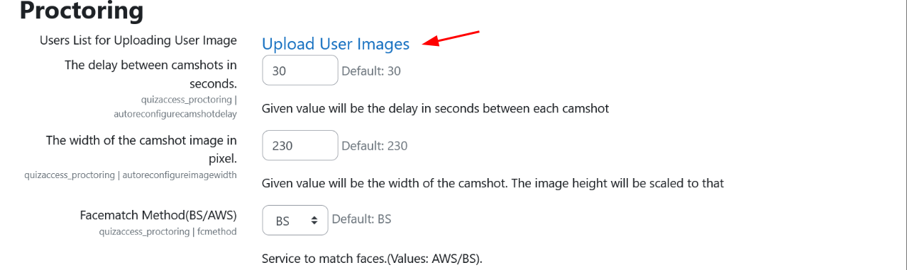
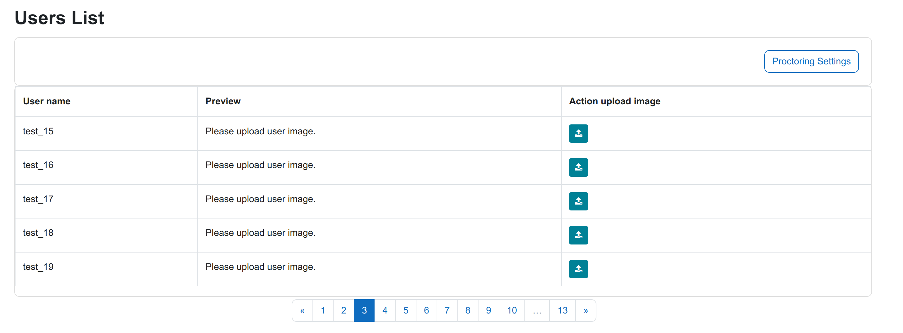
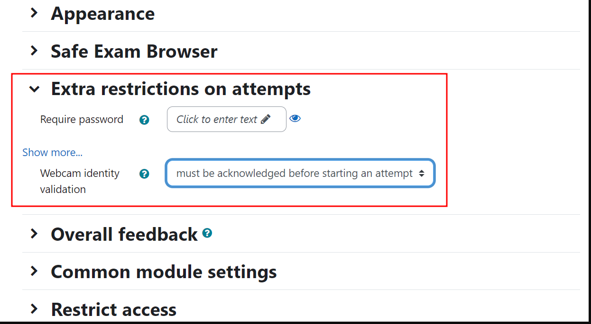
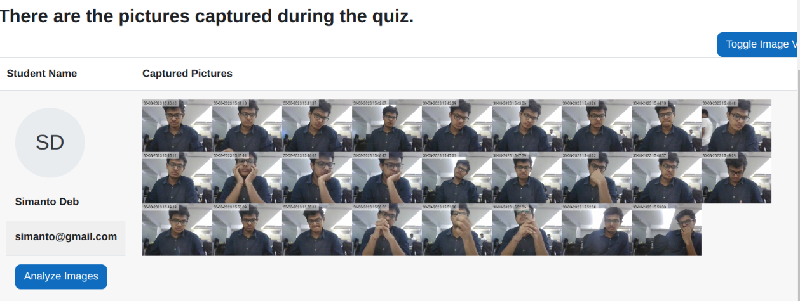

### Tutorial para Instalar e Configurar o Plugin Moodle Proctoring com Reconhecimento Facial AWS

#### Passo 1: Instalar o Plugin Moodle Proctoring

1. **Instalar via Download do Arquivo ZIP**:
   - Faça o download do arquivo ZIP [quizaccess_proctoring_moodle](https://moodle.org/plugins/download.php/29922/quizaccess_proctoring_moodle41_2023091000.zip) compativel com o Moodle 3.11.11.
   - Faça upload do arquivo ZIP em `Administração do Site > Plugins > Instalar Plugins`.
   - Como administrador do Moodle, visite a administração do site para finalizar a instalação.

#### Passo 2: Configurar o Plugin

1. **Configurações do Plugin**:

   - Navegue até `Administração do Site > Plugins > Proctoring`.

2. **Upload de Imagens dos Usuários**:

   - Use a opção `Upload User Images` para adicionar imagens de usuários para verificação.
     
   - Inserir uma imagem dos usuários que iram testar o plugin.
     

3. **Selecionar Método de Reconhecimento Facial**:

   - Selecione a AWS como `Facematch Method`.
   - Adicione a `AWS key`.
   - Adicione a `AWS secret`.
     

4. **Configurações Adicionais**:

   - **Validar Rosto no Início do Quiz**: Habilite a validação facial antes de tentar o quiz. Usuários não poderão tentar o quiz se o rosto não corresponder com a imagem carregada.
     
   - **Agendador de Tarefa de Correspondência de Rosto**: As imagens de quizzes podem ser analisadas por uma tarefa agendada automaticamente. Isso pode ser habilitado nas configurações.
     
   - Devemos testar os 2 cenarios, i.e, testar a melhor experiencia do usuario: se funciona melhor impedindo do estudantes prosseguir ou fazer o reconhecimento facial posteriormente.
   - Para isso, devemos desabilitar o `Validate Face on Quiz Start` e setar um valor para `Number of facematch per quiz` ou vice-versa.

#### Passo 3: Permitir Acesso à Webcam Antes de Tentar o Quiz

- **Acesso à Webcam**: O estudante será solicitado a permitir acesso à webcam para o exame antes de tentar o quiz.

#### Passo 4: Tentando o Quiz

1. **Configurações do Quiz**:

   - Vá para as configurações do seu quiz (Editar Quiz).
   - Mude as ‘Restrições extras nas tentativas’ para ‘deve ser reconhecido antes de iniciar uma tentativa’.
     

- Durante a tentativa do quiz, a página do quiz aparecerá como mostrado.
  

#### Passo 5: Relatório de Proctoramento

- **Visualizar Relatório de Proctoramento**: Os administradores podem visualizar o relatório de proctoramento e analisar as imagens usando o serviço AWS Face Rekognition.
  

### Outras informacoes

- Se houver algum problema, seguir o [manual de instalacao](https://moodle.org/plugins/quizaccess_proctoring)
